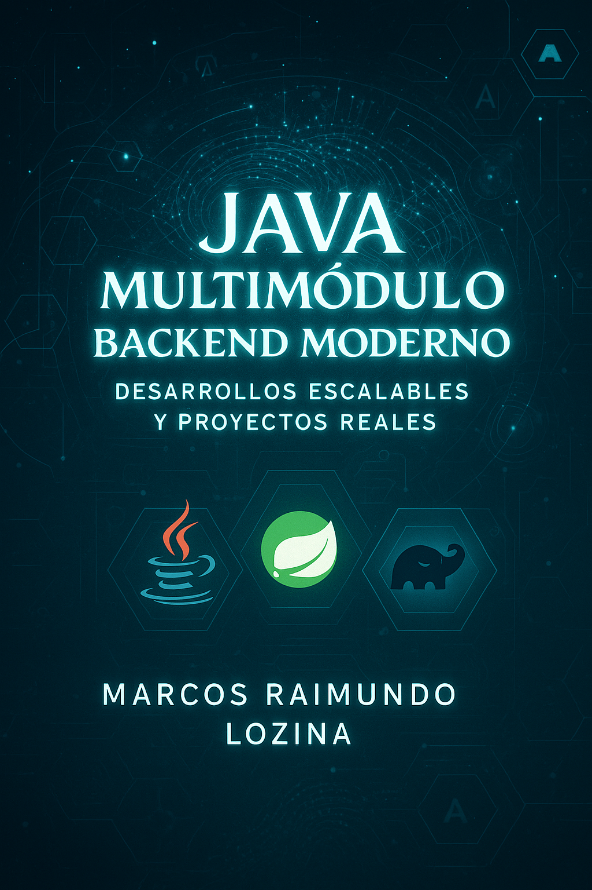

# 📘 Java Multimódulo para Backends Modernos

Este proyecto es una base profesional para desarrollar aplicaciones en **Java 21** con **Gradle Kotlin DSL**, siguiendo buenas prácticas modernas de modularización, automatización y arquitectura limpia.  
Es el repositorio que acompaña el eBook 📗 *"Java Multimódulo para Backends Modernos"*.

---

## 🚀 ¿Qué incluye este proyecto?

- ✅ Java 21 + Spring Boot 3.2.x
- ✅ Estructura **multimódulo** (`domain`, `application`, `infrastructure`, `config`)
- ✅ Gestión de dependencias y versiones centralizada con `buildSrc`
- ✅ Plugins integrados: Spring Boot, JaCoCo, dependency management, etc.
- ✅ Pruebas automatizadas con JUnit
- ✅ Tareas personalizadas (`printVersion`, `testCoverage`, `lintAll`, etc.)
- ✅ Cobertura de código con JaCoCo y reportes HTML
- ✅ Pipeline de CI con GitHub Actions
- ✅ Archivos profesionales: `README.md`, `.gitignore`, `LICENSE`, `CHANGELOG.md`

---

## 📚 Índice de contenidos del eBook

1. [🚀 ¿Por qué Gradle puede transformar tu proyecto?](es/01-introduccion-gradle.md)
2. [🤔 Gradle vs Maven: ¿cuál elegir y por qué?](02-gradle-vs-maven.md)
3. [🛠️ Configuración profesional del entorno](es/03-configuracion-entorno.md)
4. [🏗️ Cómo se arma un proyecto Gradle profesional](es/04-estructura-proyecto.md)
5. [📦 `buildSrc`: organizando dependencias y lógica de build](es/05-buildSrc-dependencias.md)
6. [📌 BOM en Spring Boot: gestioná versiones sin dolores de cabeza](es/06-spring-boot-boms.md)
7. [🧠 Errores comunes y buenas prácticas Gradle](es/07-buenas-practicas.md)
8. [🗂️ Repositorio base ideal para escalar](es/08-repositorio-base.md)
9. [🔄 De la teoría a la práctica: Arquitectura Hexagonal](es/09-arquitectura-hexagonal.md)
10. [🧪 Testing e Integración Continua](es/10-ci-testing-integracion.md)
11. [🏁 Conclusión](es/11-conclusion.md)
12. [📘 Glosario](es/glosario.md)
13. [🤝 Recursos, comunidad y próximos pasos](es/12-recursos-y-comunidad.md)

---

## 💻 Cómo ejecutarlo

```bash
./gradlew clean build
./gradlew :config:bootRun
```

```bash
# Para ejecutar solo los tests
./gradlew test

# Para generar cobertura de código
./gradlew jacocoTestReport
```

---

## ☕ Requisitos

- JDK 21 instalado (recomendado: Temurin u OpenJDK)
- Gradle 8.7+
- IntelliJ IDEA (ideal para Kotlin DSL y toolchains)

> 💡 El proyecto está configurado con `java.toolchain`, por lo que Gradle puede descargar automáticamente JDK 21 si no está instalado localmente.

---

## 🎙️ Unite a la Comunidad Base Java

🧑‍💻 ¿Querés compartir tus dudas, sugerencias o seguir aprendiendo?

Sumate a nuestra comunidad en Discord:

- Compartir experiencias con otros lectores del eBook
- Hacer preguntas técnicas sobre Gradle, Spring o Java
- Recibir actualizaciones de nuevos contenidos
- Conectar con desarrolladores y aprender en comunidad

👉 **[Entrar al Discord ahora](https://discord.gg/E6ym8JUx)**

---

## 🧠 ¡Tu opinión nos ayuda a mejorar!

Completá este breve formulario para dejar tu feedback sobre el eBook:

👉 **[Formulario de Feedback – Java Multimódulo para Backends Modernos](https://forms.gle/2JT8CqevhfwvwciZA)**

