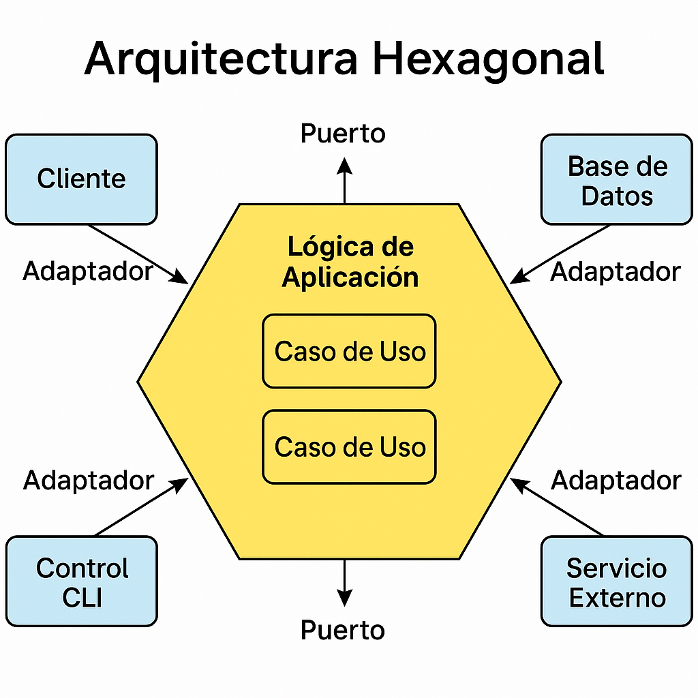

# 9. 🧱 Próximo paso: Arquitectura Hexagonal

---

## 🔁 Diagrama de arquitectura hexagonal

---

En este módulo se introduce el paradigma de **Arquitectura Hexagonal** (también conocida como *Ports and Adapters*), una estrategia que permite separar el **núcleo del negocio** de los detalles tecnológicos como frameworks, bases de datos o APIs externas. Esta separación favorece la mantenibilidad, testabilidad y adaptabilidad del sistema a largo plazo.

---

## 🚀 ¿Por qué adoptar Arquitectura Hexagonal?

- Permite desarrollar un **modelo de dominio limpio y estable**
- Facilita el **testeo unitario** del negocio sin dependencias externas
- Mejora la **adaptabilidad tecnológica**: cambios en persistencia o presentación no afectan al dominio
- Reduce el **acoplamiento** entre capas
- Es compatible con enfoques modernos como DDD, Clean Architecture y microservicios

---

## 📌 ¿Qué se construirá en el próximo módulo?

El siguiente eBook se centrará en **materializar este enfoque** en un proyecto real con Java + Spring Boot. Se trabajará sobre la base ya construida:

- `domain/`: contiene el modelo de negocio puro (entidades, value objects, lógica de dominio)
- `application/`: implementa casos de uso como puertos que orquestan el dominio
- `infrastructure/`: adaptadores tecnológicos (bases de datos, REST, eventos, etc.)
- `config/`: inicialización y configuración técnica de Spring Boot

Se prioriza que la dependencia fluya **de afuera hacia adentro**, manteniendo el dominio libre de referencias a tecnologías.

---

## 🧩 Comandos útiles para proyectos multimódulo

En proyectos como el de este eBook, estructurados en varios módulos independientes, es fundamental dominar los comandos Gradle adecuados:

| Comando                                     | Descripción                                                                 |
|---------------------------------------------|-----------------------------------------------------------------------------|
| `./gradlew :domain:build`                   | Compila el módulo `domain` de forma aislada                                |
| `./gradlew :application:test`               | Ejecuta los tests del módulo `application`                                 |
| `./gradlew clean build`                     | Limpia y construye todos los módulos del proyecto                          |
| `./gradlew dependencies`                    | Muestra el árbol de dependencias general                                   |
| `./gradlew projects`                        | Lista los módulos registrados (`application`, `domain`, etc.)              |
| `./gradlew -p domain build`                 | Ejecuta desde raíz apuntando al módulo `domain`                            |
| `./gradlew lintAll`                         | Ejecuta la tarea personalizada definida en `buildSrc/CustomTasks.kt`       |
| `./gradlew :application:bootRun`            | Ejecuta la aplicación Spring Boot desde el módulo `application`            |
| `./gradlew :config:bootRun`                 | Inicia la app desde el módulo `config` si allí está definida la clase main |
| `./gradlew :domain:classes`                 | Compila únicamente el código del módulo `domain`                           |
| `./gradlew :infrastructure:classes`         | Compila el módulo `infrastructure`                                          |
| `./gradlew :application:compileJava`        | Compila las clases Java del módulo `application`                           |
| `./gradlew :config:compileJava`             | Compila las clases Java del módulo `config`                                |

> 💡 Sugerencia: Agregá el flag `--scan` para obtener un reporte gráfico del build en tu navegador.

---

## 📖 Continuá tu camino

Este capítulo marca la transición hacia una forma de desarrollo basada en el **dominio como centro del sistema**.  
En el próximo módulo vas a implementar la Arquitectura Hexagonal paso a paso, aplicando las mejores prácticas del mundo real con Spring Boot.

---

## 🧠 Ejercicio propuesto

**Objetivo**: Comprender la separación conceptual de capas.

> 🧩 Elegí un proyecto que ya tengas (puede ser un CRUD básico) y realizá:
> - Un análisis de qué clases pertenecen al dominio, puertos o adaptadores
> - Un diagrama esquemático (puede ser a mano) de su arquitectura actual
> - Una propuesta de reorganización inspirada en el modelo hexagonal

📤 **Bonus**: Publicá tu refactorización o diagrama en LinkedIn y compartí tu experiencia.

---

## ✅ Checklist de preparación

- ✅ Comprendí el concepto de Arquitectura Hexagonal y su objetivo principal
- ✅ Identifiqué los módulos clave del proyecto (`application`, `domain`, `infrastructure`, `config`)
- ✅ Ejecuté comandos Gradle específicos para construir módulos aislados
- ✅ Probé ejecutar `bootRun` desde módulos con clase principal de Spring Boot
- ✅ Verifiqué que la lógica de dominio no depende de frameworks ni tecnologías externas
- ✅ Me siento preparado para avanzar con una implementación real en el siguiente capítulo